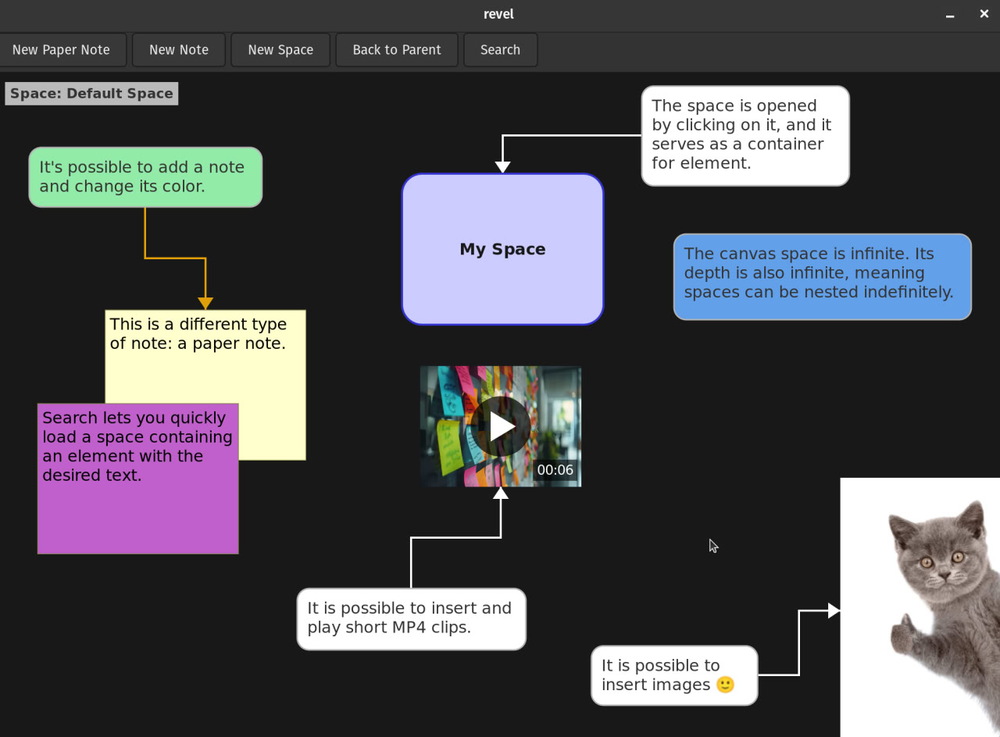

# Revel

Note taking brainstorming app

# Features:

* stora all data in a single portable SQLite3 database file
* full-text search using BM25 ranking
* store & play short MP4 clips
* create notes, paper notes
* connect elements with arrows
* paste images and annotate them
* fork = independent copy. clone = by text or size, with properties kept in sync between elements
* resize, move, delete, change background color of elements
* infinite canvas space
* organize elements into nested spaces (infinite space depth)
* move elements between spaces
* undo/redo for the current space
* execute a simple DSL to programmatically create notes and connections
* draw on canvas (freehand drawing and straight line mode)
* change text color, font size, style, name



## Dependencies

GTK4, SQLite3, GStreamer

```
# UI
sudo apt install libgtk-4-dev
# Storage
sudo apt install libsqlite3-dev
# Video support
sudo apt install libgstreamer1.0-dev libgstreamer-plugins-base1.0-dev gstreamer1.0-plugins-base gstreamer1.0-plugins-good gstreamer1.0-libav
```

## To run on x86_64 GNU/Linux:

`make -B -j 7 && ./revel`

## How to add app launcher:

1. Copy `revel.desktop` to `~/.local/share/applications/`  
2. Update Exec and Icon path  
3. `update-desktop-database ~/.local/share/applications/`  

