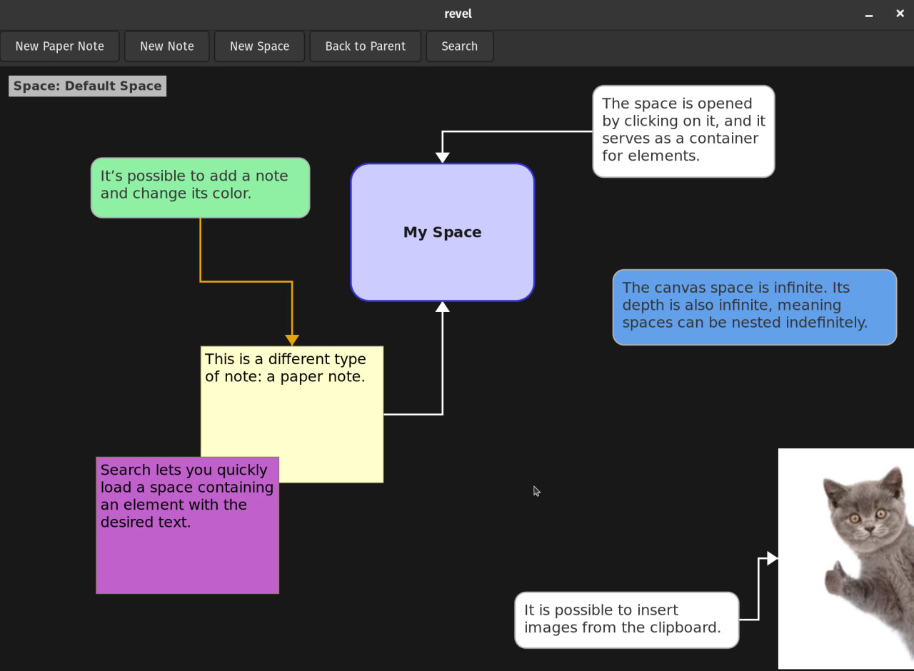

# Revel

Note taking brainstorming app

# Features:

* stora all data in a single portable SQLite3 database file
* full-text search using BM25 ranking
* create notes, paper notes
* connect elements with arrows
* paste images from clipboard and annotate them
* fork = independent copy. clone = by text or size, with properties kept in sync between elements
* resize, move, delete, change color of elements
* infinite canvas space
* organize elements into nested spaces (infinite space depth)



## Dependencies

GTK4, sqlite3

```
sudo apt install libgtk-4-dev
sudo apt install libsqlite3-dev
```

## To run on x86_64 GNU/Linux:

`make -B -j 7 && ./revel`

## How to add app launcher:

1. Copy `revel.desktop` to `~/.local/share/applications/`  
2. Update Exec and Icon path  
3. `update-desktop-database ~/.local/share/applications/`  

