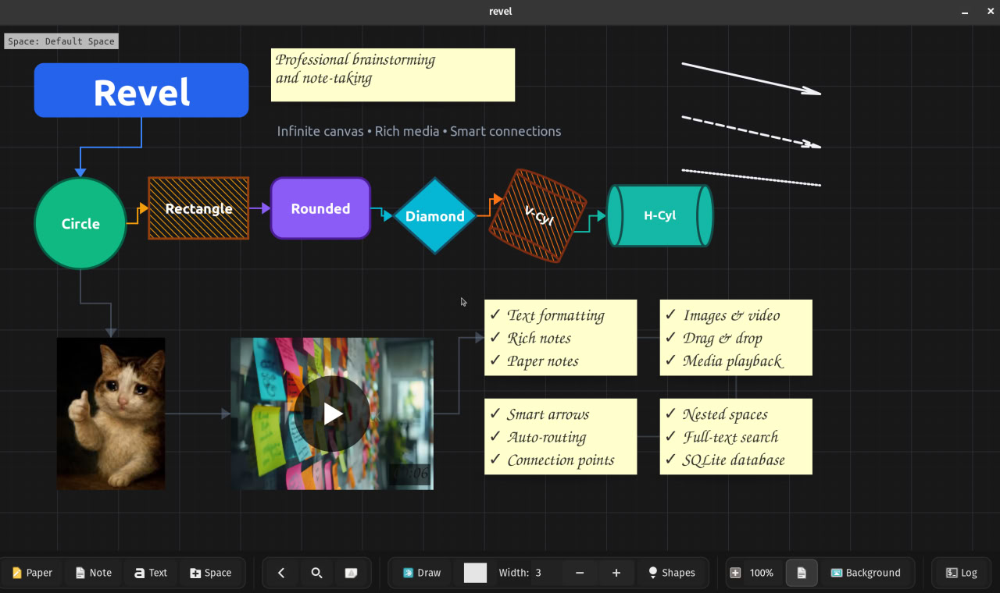

# Revel

Infinite canvas for notes and visual thinking.


## What it does

Everything lives in a single SQLite file. Search uses BM25 ranking. Canvas is infinite with nested spaces you can organize however you want.

**Content:**
- Text notes (plain or formatted)
- Shapes (circles, rectangles, triangles, diamonds, bézier curves, graphs)
- Stroke styles (solid/dashed/dotted), fill patterns (solid/hachure/cross-hatch)
- Freehand drawing
- Images, videos (MP4), audio (MP3)

**Connections:**
- Arrows between any elements (curved or straight)
- 4-point attachment system

**Working with stuff:**
- New elements find empty space automatically (spiral search)
- Clone things: fork for independent copies, or link by text/size/position/color
- Layer ordering, rotation, colors
- Add private notes to elements

**Automation:**
- DSL for scripting layouts
- Animations: move, resize, color, fade
- 8 interpolation curves (linear, bezier, ease-in/out, bounce, elastic, back)

**UI:**
- Right-click menus, keyboard shortcuts (`F1` for list)
- Space tree sidebar
- Undo/redo with action log

## Performance

Handles large datasets. Viewport culling means only visible stuff gets rendered. Tested with 10k+ elements.


## Building

Dependencies (Ubuntu/Debian):
```bash
sudo apt install libgtk-4-dev libsqlite3-dev libjson-glib-dev \
    libgstreamer1.0-dev libgstreamer-plugins-base1.0-dev \
    gstreamer1.0-plugins-base gstreamer1.0-plugins-good gstreamer1.0-libav
```

Build:
```bash
make -j$(nproc) && ./revel
```

Try the demo:
```bash
rm -f demo.db && ./revel --dsl examples/showcase.dsl demo.db
```



## AI Integration

Toolbar has AI button. Calls external CLI tools (config in `config/ai_providers.json`) and sends current canvas as DSL context. Binaries need to be in `$PATH`. Settings in gear menu. History saved to database.

## Layout

```
src/        C code
tests/      Tests
examples/   DSL examples
build/      Build output
```

Full DSL docs: [DSL.md](DSL.md)

## Desktop launcher

```bash
cp revel.desktop ~/.local/share/applications/
# Edit Exec and Icon paths in the file
update-desktop-database ~/.local/share/applications/
```
